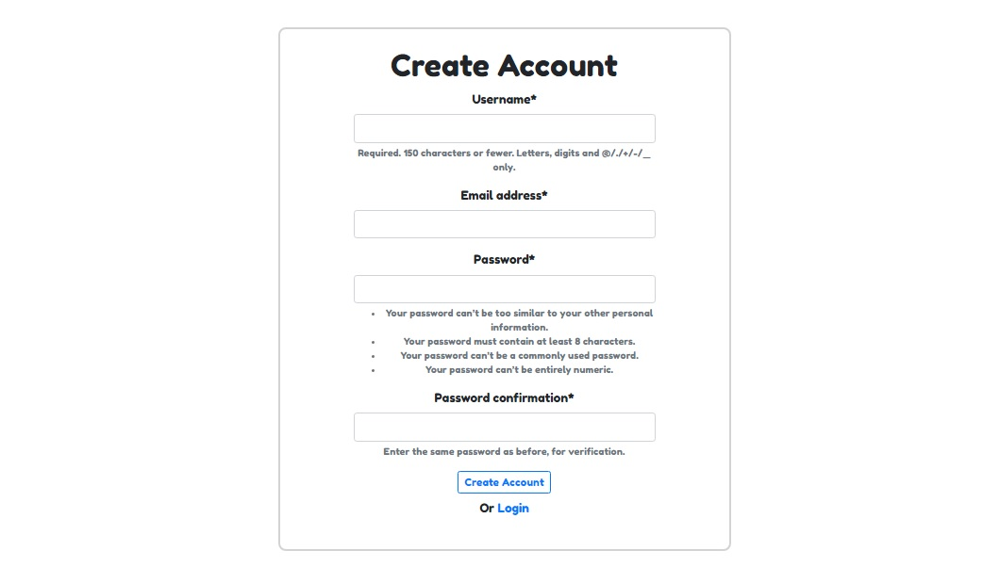
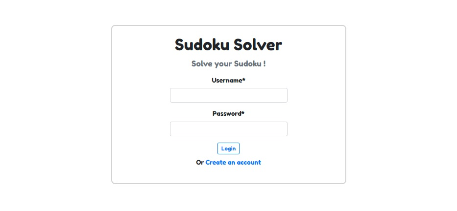
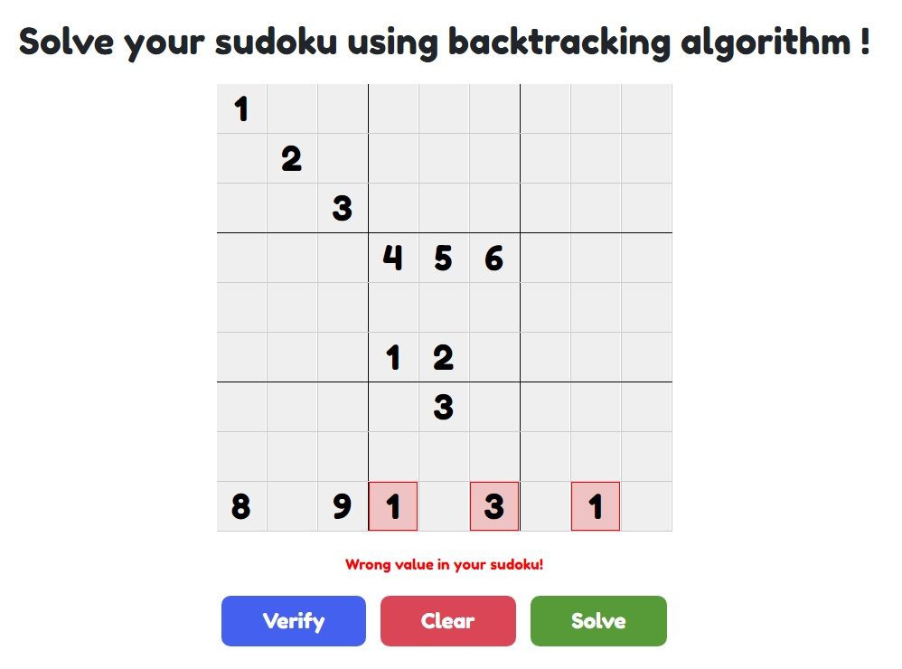
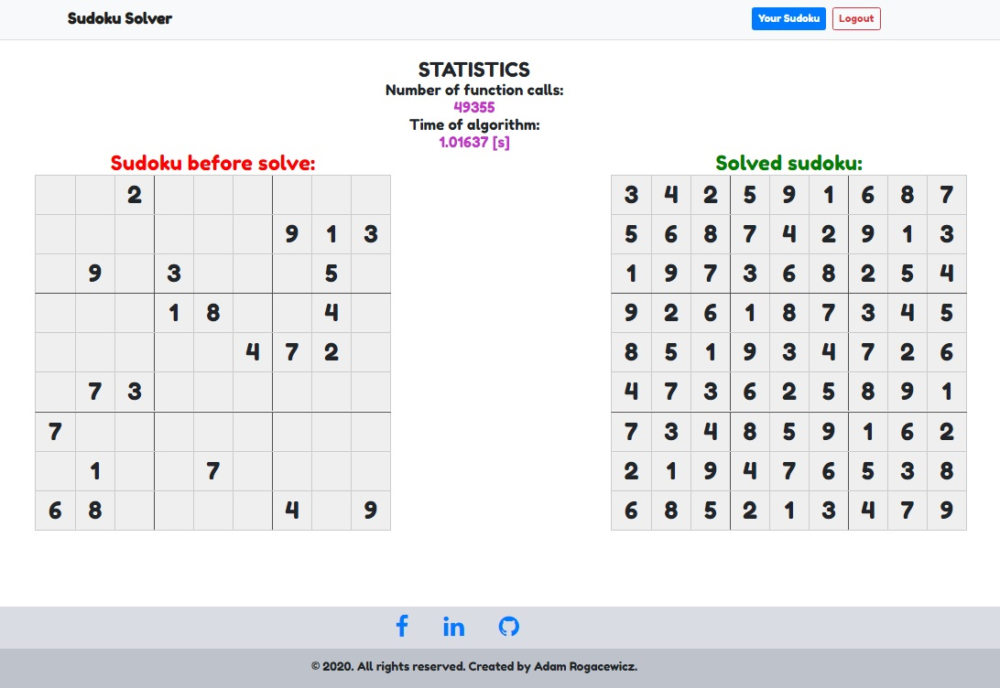
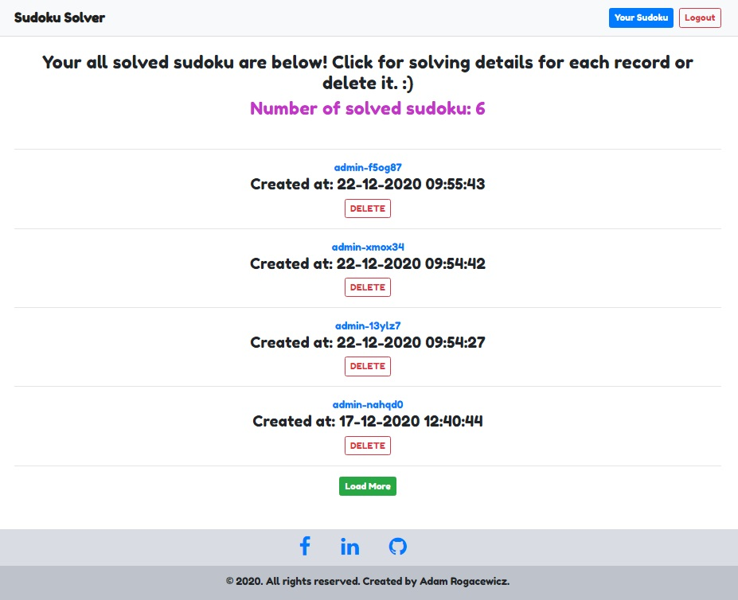

# SudokuSolver 

## DESCRIPTION
Czy wiesz co to jest backtracking algorithm? Jeśli nie to dobrze trafiłeś :). Stworzyłem prostą aplikację webową, która umożliwia rozwiązanie tablicy sudoku przy pomocy właśnie tego algorytmu. W skrócie: backtracking is a general algorithm for finding all (or some) solutions to some computational problems, notably constraint satisfaction problems, that incrementally builds candidates to the solutions, and abandons a candidate ("backtracks") as soon as it determines that the candidate cannot possibly be completed to a valid solution [wikipedia].
Innym ciekawym zastosowaniem tego algorytmu jest tzw. eight queens puzzle problem, który polega na tym żeby umiejscowić na szachownicy 8 chess queens tak aby, żadna z nich nie mogła zbić jednym ruchem innej [wikipedia]
W kontekście mojej aplikacji backtracking szuka pustego pola w tablicy sudoku, nadaje mu numer 1 i sprawdza czy tablica jest poprawna. Jeżeli nie, to nadaje mu kolejny numer (2) i sprawdza po raz kolejny aż do 9 numeru. Jeżeli algorytm znajdzie poprawny numer to przechodzi do kolejnego pustego pola, jeśli nie to cofa się o jedno pole i szuka kolejnego numeru dla poprzedniego pola. Brzmi trochę skomplikowanie, ale jest to stosunkowo prosty algorytm. Jego wadą jest bardzo duża ilość wywołań funkcji w przypadku bardzo trudnych sudoku. W aplikacji jest możliwość podejrzenia ilości wywołań funkcji dla każdego rozwiązania oraz czasu trwania algorytmu.

Aplikację stworzyłem ponieważ chciałem przećwiczyć frontendowy framework Vue.js w połączeniu z API w DRF oraz chciałem poprawić swoje skille w HTML i CSS a także JS. ;)

## FEATURES
- Tworzenie konta (rejestracja) oraz logowanie do aplikacji
- Sprawdzenie poprawności wprowadzonych liczb do tablicy sudoku
- Rozwiązanie sudoku poprzez backtracking algorithm
- Podejrzenie rozwiązanych tablic sudoku wraz ze statysytkami działania algorytmu (czas działania oraz liczba wywołań funkcji)
- Usuwanie rozwiązanych sudoku

## TECHNOLOGIES AND LIBRARIES
Main technologies:
- Python 3.9.1
- JavaScript
- Django 3.0.8
- Django Rest Framework 3.11.1
- Vue.js 2.6.11
- HTML 5
- CSS 3
- Bootstrap 4.5.0

Libraries for connecting frontend with backend:
- django webpack_loader 0.7.0
- webpack bundle tracker 0.4.3

Libraries for creating registration and login forms:
- django-crispy-forms 1.9.2

Libraries for user authentication:
- django-allauth 0.42.0
- django-registration 3.1
- django-rest-auth 0.9.5

## HOW TO INSTALL LOCALY?
1. Create folder for app.
2. Open your code editor inside that folder.
3. Create virtual environment and activate it:
```sh
$ python -m venv venv (if you work on Windows system)
```
4. Clone repository:
```sh
$ git clone https://github.com/adm108/SudokuSolver.git
```
5. Go to SudokuSolver folder where requirements.txt file is and install all packages:
```sh
$ pip install -r requirements.txt
```
6. Use manage.py to enter following commands. Generate SQL commands:
```sh
$ python manage.py makemigrations
```
7. Execute SQL commands:
```sh
$ python manage.py migrate
```
8. Create superuser (enter email, username and password):
```sh
$ python manage.py createsuperuser
```
9. Go to frontend folder and install all frontend packages (you should have node.js engine installed):
```sh
$ npm install
```
10. Now you can open 2 terminal windows and run 2 local servers (frontend and backed). Inside frontend folder:
```sh
$ npm run serve
```
11. Inside SudokuSolver folder (where manage.py is):
```sh
$ python manage.py runserver
```
12. You can log in using superuser account or you can create the new one and then you can use backtracking algorithm to solve your sudoku!

## LICENCE
It is a open source project. Anybody is free to use, study, modify and distribute this project for any purpose.

## RESOURCES
##### Great course about Django, Django REST Framework and Vue.js frameworks. It shows how to use all above mentioned technologies in one project [Michele Saba]:
https://www.udemy.com/course/the-complete-guide-to-django-rest-framework-and-vue-js/

##### Simple explanation how to write backtracking algorithm for solving sudoku board [Tech With Tim]:
https://www.youtube.com/playlist?list=PLzMcBGfZo4-kE3aF6Y0wNBNih7hWRAU2o

##### Cool concept for creating sudoku board in HTML and CSS also with checking the correctness of the entered values [Morgan Schmiedt]:
https://www.youtube.com/watch?v=O-rR1iuzhmU&t=1257s&ab_channel=MorganSchmiedt

## SOME SCREENS FROM THE APP
<div align="center">Registration form</div>



<div align="center">Login form</div>



<div align="center">Sudoku board with CLEAR, VERIFY and SOLVE buttons. Shot screen after clicking VERIFY button</div>




<div align="center">Solved sudoku with statistics</div>



<div align="center">List of solved sudoku with DELETE and LOAD MORE buttons</div>


